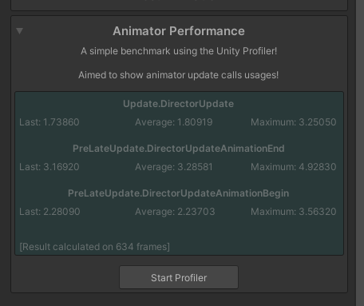
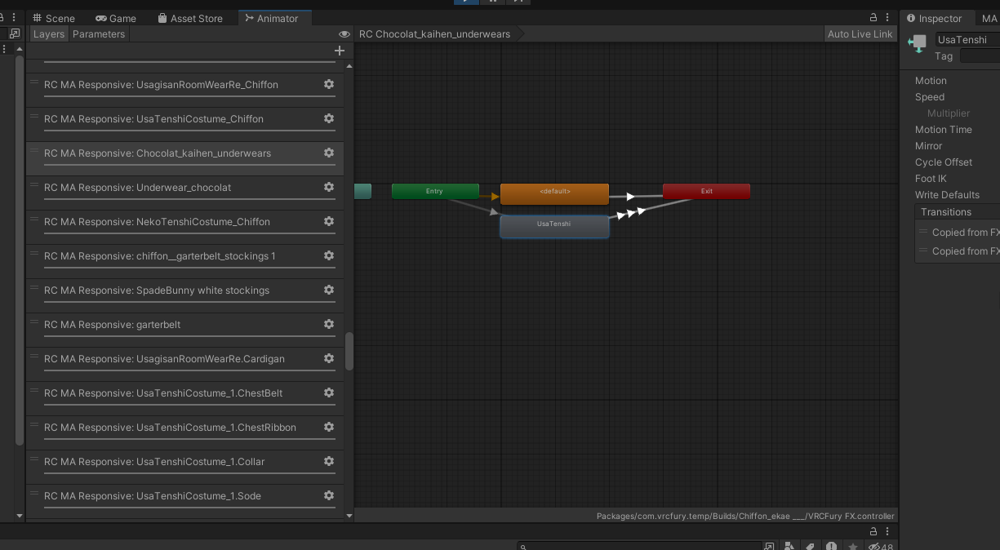
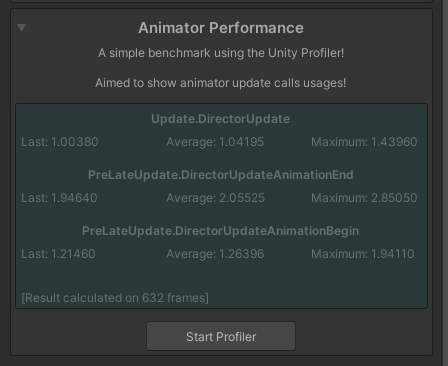
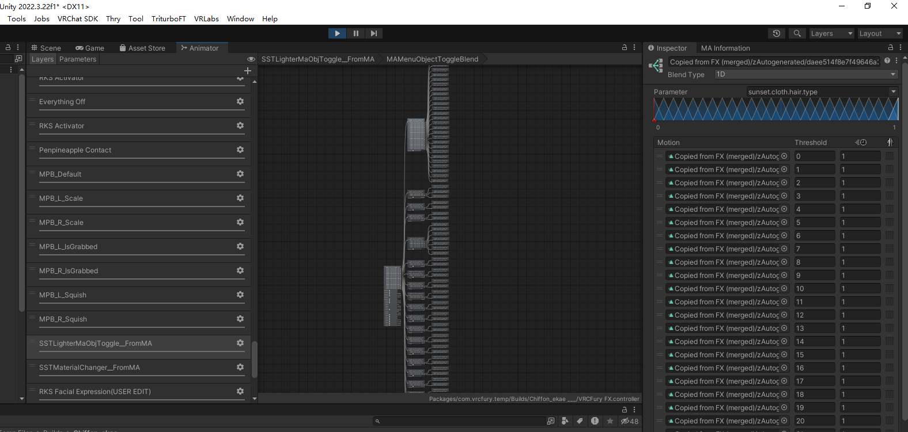

# MA-Reactive-Components-Optimizer

简体中文 | [English](README.md)

本工具用于优化 [Modular Avatar](https://github.com/bdunderscore/modular-avatar) 响应式组件占用过多 Animator Layer 导致模型卡顿的问题。

适用范围：仅通过 `MA Menu Item` 控制 `MA Object Toggle` 与 `MA Material Setter` 的组件。其他场景 **不适用** 本工具。

# 工作原理

`MA Object Toggle` 与 `MA Material Setter`  均为[响应式组件](https://modular-avatar.nadena.dev/docs/reference/reaction)。每个这种组件都会创建一个单独的 Layer 以实现其响应式相关的功能。

每个 Layer 都会独立执行一次状态机的逻辑判断以及权重混合。过多的 Layer 会显著增加 CPU 开销。

当**仅与 MA Menu Item 配合使用**时，我们只需要根据相应的参数值控制物体开关以及材质切换。在这种情况下，将所有开关通过 `Blend Tree` 合并到同一个 Layer 中，可以显著减少 Animator 耗时，从而提升性能。

# 安装

- [Modular Avatar](https://github.com/bdunderscore/modular-avatar) 
- 本工具基于 [Animator As Code V1](https://docs.hai-vr.dev/docs/products/animator-as-code)。使用前请安装以下包:
  - [av3-animator-as-code](https://github.com/hai-vr/av3-animator-as-code)
  - [animator-as-code-vrchat](https://github.com/hai-vr/animator-as-code-vrchat)
  - [modular-avatar-as-code](https://github.com/hai-vr/modular-avatar-as-code)
- 最后导入本包即可

# 使用方法

`Tools -> sunset -> MA Optimizer `

## 菜单对象开关优化组件
 - 放置在模型任意位置。每个模型 **只能** 有一个该组件。
 - Excludes With Empty Clip：将指定对象加入排除名单，不删除其动画。在生成的 Blend Tree 中以空动画占位（推荐）。
 - Excludes With No Clip：将指定对象加入排除名单，不删除其动画，也 **不** 在 Blend Tree 中生成占位动画。

## 材质设置优化组件
- 放置在同时存在 MA Menu Item 和 MA Material Setter 的对象上，插件会自动优化。

# 优化效果

## 优化前

## 优化后

