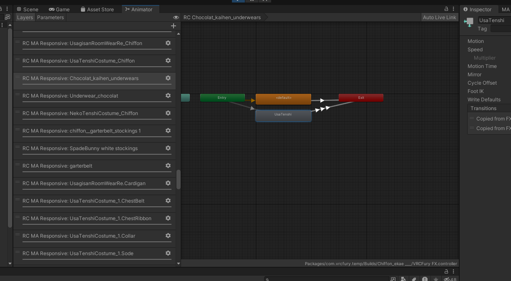
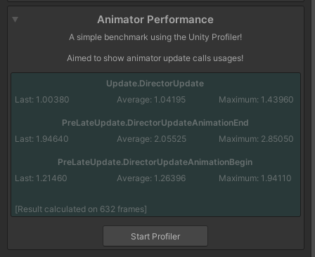

# MA-Reactive-Components-Optimizer

[简体中文](README-CN.md) | English

This tool mitigates lag caused by [Modular Avatar](https://modular-avatar.nadena.dev/docs/reference/reaction/shape-changer) reactive components occupying too many Animator layers.

Applicable scope: components where MA Object Toggle and MA Material Setter are driven **only** by MA Menu Items. Do NOT use it in other setups.

# How It Works

`MA Object Toggle` and `MA Material Setter` are both [reactive components](https://modular-avatar.nadena.dev/docs/reference/reaction). Each of these components creates a separate Layer to implement its reactive functionality.

Each Layer independently executes the state machine’s logic checks and weight blending. Too many Layers will significantly increase CPU overhead.

When **used only in conjunction with MA Menu Item**, we only need to control object toggles and material switching based on the corresponding parameter values. In this case, merging all toggles into the same Layer through a `Blend Tree` can significantly reduce Animator overhead, thereby improving performance.

# Installation

- [Modular Avatar](https://github.com/bdunderscore/modular-avatar)
- This tool is based on [Animator As Code V1](https://docs.hai-vr.dev/docs/products/animator-as-code). Before use, please install the following packages:
  - [av3-animator-as-code](https://github.com/hai-vr/av3-animator-as-code)
  - [animator-as-code-vrchat](https://github.com/hai-vr/animator-as-code-vrchat)
  - [modular-avatar-as-code](https://github.com/hai-vr/modular-avatar-as-code)
- Finally, import this package.

# Usage

`Tools -> sunset -> MA Optimizer `

## Menu Object Toggle Optimizer
- Place the component anywhere under the avatar (only **one** per avatar).
- Excludes With Empty Clip – Adds the specified objects to the exclusion list without deleting their animations. A blank clip placeholder is inserted in the generated Blend Tree (recommended).
- Excludes With No Clip – Adds the specified objects to the exclusion list, keeps their animations, and inserts **no** placeholder in the Blend Tree.

## Material Setter Optimizer

- Attach it to objects that contain **both** MA Menu Item and MA Material Setter; the plugin optimises them automatically.

# Optimization result

## Before optimization

## After optimization

